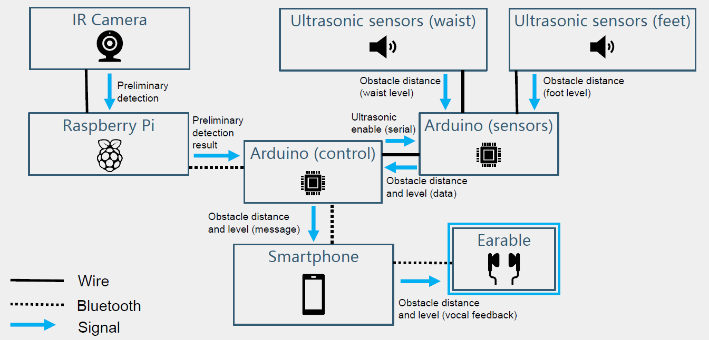
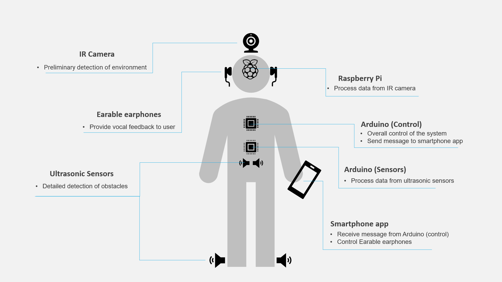
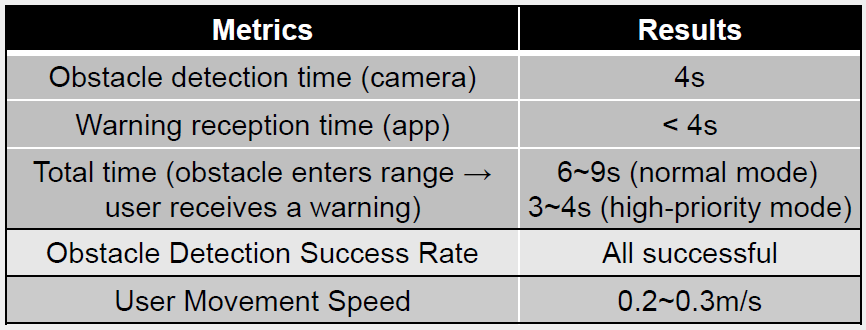

# Palantir2021: Obstacle avoidance system for the visually impaired

### Team members

Jinchen Wu, Ruoye Wang

### Required Submissions

* [Proposal](proposal)
* [Midterm presentation slides](M202AMidtermSlides_RuoyeWang_JinchenWu.pdf)
* [Final presentation slides](M202A_finalSlides_605625594RuoyeWang_305627306JinchenWu.pdf)
* [Final presentation video](https://youtu.be/H867mE56Vog)

## Table of Contents

* [Abstract](#1-abstract)
* [Introduction](#2-introduction)
* [Related Work](#3-related-work)
* [Technical Approach](#4-technical-approach)
* [Evaluation and Results](#5-evaluation-and-results)
* [Discussions](#6-discussion)
* [Conclusion](#7-conclusion)
* [References](#8-references)

## 1 Abstract

The objective of this project is to build a system to detect and warn obstacles for visually impaired people to improve their outdoor mobility. As a new choice in the market of such devices, this obstacle avoidance system is expected to be low-cost, user-friendly and robust. IR camera and ultrasonic modules are used to detect the environment, whose data is processed by Raspberry Pi 3 and Arduino Nano 33 BLE Sense respectively. The processed data is sent to a controller Arduino, which then sends message to a smartphone application who can vocally remind the user about the obstacles through earphone. The test results showed that the system has a high obstacle detection rate, while the response time is a satisfactory 3 to 9 seconds, with which a user can walk in a speed of 2 to 3 seconds per step.

## 2 Introduction

### 2.1 Motivation & Objective

More than 80% of information that human brain processes is visual. Therefore, visually impaired people face a great challenge of sensing the outside world, especially when they need to move through an unknown environment. The goal of this project is to build a low-cost, robust and user-friendly obstacle avoidance system to detect and warn obstacles for the visually impaired users, which improves their outdoor mobility, and quality of life.

### 2.2 State of the Art & Its Limitations

One of the oldest and most useful assistance for visually impaired people has been the guide dogs, who have physical needs and high training cost, which makes them less affordable to the majority of people in need. Those people usually employ a white cane, which has to be held continuously by one hand and only has a limited, near-ground range of detection.

The development of IT industry has brought a wide range of inventions to aid visually impaired people in their indoor and outdoor activities. Earliest inventions employ cheap ultrasonic and sonar sensors, which are still welcomed in today's designs, and lasers to detect the distance of obstacles. However, due to the difficulties in calibration, manual scanning and reflective error exclusion [1], those sensors are mostly used alongside more accurate detectors as auxiliary equipment.

Modern obstacle avoidance systems are embedded into wearable or portable devices. Examples of the former are Eyeronman smart vest [2] that uses an array of vibrators to translate sensor data to tactile information, and Project Guideline [3] belt that uses camera to sense and sound tone to provide feedback. The latter is mostly realized in the form of smart canes, and are widely commercialized, including Augmented Cane [4], and WeWalk [5].

The most obvious limitation of modern devices is high cost, mainly due to the employment of complicated sensors and high-standard algorithms. Also, some devices like smart canes need to be held at all times, which limits the hand mobility of its user. This project tries to find a new trade-off point between cost and performance by employing simpler and cheaper but still sufficient algorithms and electronics to realize obstacle-avoidance functions.

### 2.3 Novelty & Rationale

Our obstacle detection system utilizes relatively simple and cheap modules. The sensors are IR camera CAM023, HC-SR04 ultrasonic sensing modules and Earable [9] earphones; the control units are Arduino Nano 33 BLE Sense (Arduino), Raspberry Pi 3 (RBPi). The system uses an alternative way of sensing: the camera performs a preliminary detection and RBPi judges if there is a nearby obstacle to be noticed; if there is, ultrasonic modules are enabled to measure the exact distance of obstacle. 

Techniques of camera image recognition, ultrasonic distance sensing, RBPi-Arduino-smartphone communications and smartphone application development are already developed and useable. With careful programming and hardware-implementing skills, the system can achieve high accuracy and a wide obstacle detection range, with fast, user-friendly voice feedback. 

### 2.4 Potential Impact

We intend to make a prototype of low-cost, high-accuracy obstacle detecting and warning system as a relatively affordable option for visually impaired people. It will provide a new possibility of the choice and combination of sensing, controlling and user-device interacting modules to the industry of obstacle avoidance devices. It allows people in need to improve their outdoor safe mobility, with relatively low cost.

### 2.5 Challenges

First, to use BLE communication on different platforms, central and peripheral devices have to be constructed on Android, Raspberry Pi and Arduino respectively and establish barrier-free communication.

Second, signals are easily blocked when several devices send data to each other through BLE.

Third, ultrasonic sensor may wrongfully detect non-obstacles, such as the user’s own body, or a passer-by, which may trigger a false alert. Therefore, a rational, error-proof mechanism needs to be carefully designed.

The last challenge is to maintain the robustness of the system, for it has many components, among which camera recognition particularly requires a lot of computing time. All these parts need to work in accordance, able to tolerate perturbations and interruptions.

### 2.6 Requirements for Success

Hardware resources:
-	Arduino Nano 33 BLE Sense *2
-	Raspberry Pi 3 *1
-	IR camera CAM023 *1
-	HC-SR04 ultrasonic sensor *4
-	eSense Earable compute platform (earphone pair) *1
-	Android Phone: XIAOMI CC 9E
-	Power module *2
-	Other auxiliary parts (wires, breadboards, etc.)
Software resources:
-	Arduino IDE
-	Android studio
Background research materials:
-	Various IEEE papers
-	Arduino tutorials
-	Raspberry Pi tutorials
-	Earable website guidance
Technical skills:
-	Arduino and Raspberry Pi programming
-	Neural network ‘YOLO’ algorithm [8] (Python)
-	Android application development (Java)
-	GitHub repository management
-	Hardware implementation and debugging
Other skills:
-	Report and presentation
-	Teamworking
-	Time management and project planning

### 2.7 Metrics of Success

A successful obstacle avoidance system must have the following properties: fast and accurate obstacle detecting, proper classification and judgement of obstacles, in-time and clear warning, easy operation and robustness. They can be qualified as:

- The speed with which the system response to obstacle (in seconds)
- The rate of successful obstacle detection (%), while the obstacles' type, distance, moving speed vary
- The speed with which a user walks under the assistance of our system

## 3 Related Work

**Augmented Cane [4]** employs a comprehensive set of modules including LIDAR, camera, GPS and IMU, whose data can be feedback to user with grounded kinesthetic omni-wheel, audio and push button.

**WeWalk [5]** has ultrasonic above-ground obstacle detection, automatic voice feedback and smartphone application-aided navigation and transportation assistant.
The above works of smart cane have proven to us the reliability of ultrasonic obstacle detection. However, their users often complain about the inconvenience of holding a heavy cane, which supports our consideration of establishing a wearable system. The smart canes, with their wide range of functions, are priced $400~500, which is not affordable to all.

**Navigation System for Blind [6]** is a set of wearable navigation system which consists of a hat, a vest and a pair of shoes. There are multiple ultrasonic modules embedded in those three parts to sense obstacles at head, waist and foot levels. GPS/GSM module allows the system to send current location as texts to a smartphone. Vocal feedback provides navigation and obstacle avoidance warnings; for those with weak hearing, vibrators on the arms are an alternative feedback method. This work inspires us to use multiple ultrasonic modules for obstacles at different heights.

## 4 Technical Approach

### 4.1 System overview

The system works as follows:

IR camera, which is placed on the user’s head, performs a preliminary detection of environment, whose data is processed by RBPi with YOLO image recognition algorithm. 

When the RBPi deems that there is an obstacle close enough to hinder the user’s movement, the ultrasonic sensors are enabled to detect the exact distance between the obstacle and the user. There are two pairs of sensors, one for waist level and one for foot level. This distance data is processed by sensor Arduino. 

Then, processed data from both types of sensors are transmitted to the controller Arduino, which sends message via BLE connection to the smartphone app, which is connected to a pair of Earable earphones by Bluetooth. Once the message shows that there is an obstacle to be avoided, the earphones will vocally remind the user about its distance and direction.

Ultrasonic module and controller Arduino are powered by 9-volt alkaline batteries via breadboard power supply module, and camera module is powered by a mobile power supply (Charge Pal).

### 4.2 Ultrasonic Module & Sensor Arduino

The popular HC-SR04 is chosen as the ultrasonic detector. Two detectors are placed in the middle of the stomach for waist-level detection, the other two are placed on the tip of left and right feet, respectively, for foot-level detection. They are connected to the D2~D9 pins of sensor Arduino by wires.

In normal operating mode, controller Arduino keeps foot-level ultrasonic detectors open all the time. We set a close threshold obstacle distance of 0.5m, which is adjustable in the code, to prevent tripping on obstacles in IR camera’s blind spot. Thus, if the user is about to hit a lower-level object that the camera fails to detect, they will be warned quickly.

When sensor Arduino receives serial [7] command from controller Arduino which enables both ultrasonic modules when the camera detects a suspected obstacle, the four ultrasonic detectors to measure distance in turn, collects data and sends them back to the controller Arduino in the format of *<left_waist, right_waist, left_foot, right_foot>* string to be decoded.

### 4.3 Raspberry Pi & IR Camera

To prevent enabled ultrasonic modules from triggering false alarms due to detection of non-obstacles, an "eye" is needed to observe the environment in advance. This role is played by IR camera and Raspberry Pi, whose obstacle recognition program is always running. If the recognized object belongs to a preset obstacle collection, Raspberry Pi opens a BLE connection with the controller Arduino to modify the value of the corresponding Arduino Characteristic. Here, Arduino serves as a peripheral device, while Raspberry Pi is the central device.

### 4.4 Smartphone Application & Earable Earphones

The Android app we built essentially functions as a BLE radio, which turns the phone into a BLE peripheral and defines unique ‘Service’ and’ Characteristic’. When controller Arduino writes data to the Characteristic, different voice alerts are broadcasted via earphone according to different values:

When user’s foot is about to hit an obstacle, a "watch your step!" alert is sent, which is the highest priority alert in the system.

When IR camera detects an obstacle, and the waist-level ultrasonic module deems that this obstacle is inside the threshold range, the user will receive message "Be careful!”

When the camera detects an obstacle and the foot-level ultrasonic module deems that this obstacle is inside the threshold range, the user will receive message "Watch out!”.

### 4.5 Overall Control Logic on Controller Arduino

The controller Arduino is started as a peripheral device of BLE. When the camera and Raspberry Pi identify the obstacle and sends a signal to the controller Arduino through BLE, the controller will send an ultrasonic detection request to the sensor Arduino through the serial port and receive the ultrasonic data returned from the same port. If this data is smaller than the preset threshold, or when sensor Arduino detects an imminent collision , central device of BLE writes an alarm signal into the app. This method of warning the user has the highest priority when implemented.

## 5 Evaluation and Results

### 5.1 Obstacle Response Speed

About 10 groups of tests, in which utilized different obstacles (couch, corridor wall, etc.), were performed. From those tests, we manually calculated the average time for the camera to detect an obstacle, the app to receive warning, and total time from obstacle entering the threshold range to user receiving a warning, which are 4 seconds, less than 4 seconds and 6~9 seconds, respectively. 

If the system works in high-priority mode, in which the foot-level ultrasonic modules are always on, the total time would be 3 to 4 seconds.

### 5.2 Obstacle Detection Success Rate

All obstacles used in the tests were successfully detected.

### 5.3 User Movement Speed

The average speed with which a user walk was measured when team members wearing the system and walking. When standard threshold (foot-level threshold 0.5m, camera threshold 2m) was used, the user could walk at a speed of 0.2 to 0.3m/s, which was approximately 2 to 3 seconds per step.

## 6 Discussion

### 6.1 Strengths

We established an obstacle avoidance system at a new trade-off point where the cost is low but the accuracy is satisfying. Compared to a smart cane, this system is easy to manufacture and does not need to be held by hand, which increases the user’s mobility. A user can conveniently receive warning from phone speaker or earphones via app; the level of ultrasonic modules can be adjusted for users of different heights or needs.

### 6.2 Weaknesses 

We also observed a few weaknesses. First, sometimes Raspberry Pi’s image processing speed can be as slow as 5 seconds (from an obstacle entering the threshold range to successful detection) due to unknown technical glitches, which is an unstable factor in the system. Second, currently hardware parts are connected with jumper wires and breadboards, which is easily loosen. Third, due to limited time of Android application development, current smartphone application has small UI buttons and no vocal feedback, which reduces accessibility for visually impaired people.

### 6.3 Future improvements

There are several possible improvements: 

First, by re-designing the algorithms, we hope to improve the image processing speed. 

Then, currently employed YOLO algorithm classifies the items it detects, which is unnecessary for our system since only the distance of obstacle is needed. In practical application scenarios, the type of environment matters: whether the obstacles are mostly at high- or low-level, or there are many people walking around (moving obstacles)? The type of environment can be detected by algorithms and then sent to the user.

Earable is able to detect and process environmental noises, which also aids in detecting the type of surroundings. Its embedded gyroscope can be used to measure acceleration and angle of head movement, which helps to calibrate the detections. These features can be further utilized.

Hardware parts can use a firmer connection such soldered wires. They can be further attached to clothing accessories like hat, waistbelt and straps so that the system is more wearable.

Our obstacle avoidance system can also be combined with navigation, to do which GPS modules should be employed, and path-planning algorithms can be used to calculate the safest, fastest route from user’s current location to their destination. Voice recognition techniques can be used to realize user-system interaction. With vocal interface, smartphone app can have an improved accessibility for users.

## 7 Conclusion

This report presents Palantir2021, an obstacle avoidance system designed to increase the mobility of people with impaired vision. It uses IR camera to perform preliminary detection of the environment, which is processed with YOLO algorithm on Raspberry Pi. If RBPi deems that an obstacle is inside the preset threshold range, controller Arduino enables ultrasonic modules to measure the distance of obstacles in detail and sends warning message to smartphone application, which then converts the message into vocal reminders. Tests showed that the system has high accuracy in obstacle detection and the response time is satisfying if the user walks slowly. 

Potential improvements of this system includes optimization of algorithm to reduce response time and environment classification, further exploration of Earable platform, firmer and more wearable hardware connection, combination with navigation, and more user-friendly UI design.

## 8 References

[1] Hossain, E., Khan, M.R., Muhida, R. and Ali, A. (2011) ‘State of the art review on walking support system for visually impaired people’, Int. J. Biomechatronics and Biomedical Robotics, Vol. 1, No. 4, pp.232–251

[2] https://tactilenavigationtools.com/#:~:text=The%20Eyeronman%2C%20is%20a%20hands,user's%20through%20superior%20situation%20awareness

[3] https://ai.googleblog.com/2021/05/project-guideline-enabling-those-with.html

[4] P. Slade, A. Tambe, M. J. Kochenderfer, Multimodal sensing and intuitive steering assistance improve navigation and mobility for people with impaired vision. Sci. Robot. 6, eabg6594 (2021)

[5] https://wewalk.io/en/

[6] https://www.youtube.com/watch?v=8tbeELHKx9Y

[7] https://forum.arduino.cc/t/serial-input-basics-updated/382007

[8] https://github.com/ultralytics/yolov5/tree/8f354362cd94c70908bf6168951b07bd32715ebe

[9] https://www.esense.io/

